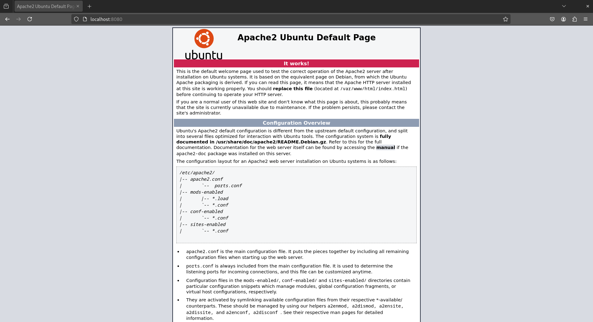
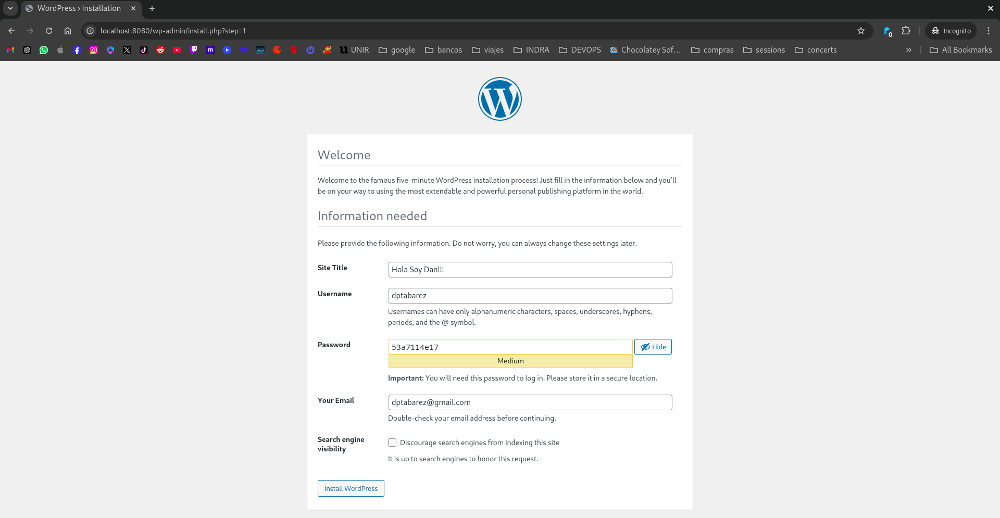
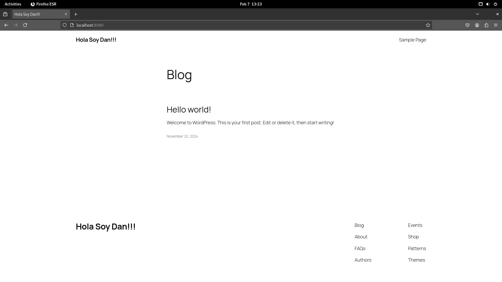

# Instalación completa de WordPress con Ansible
## Tabarez Perez Danny Paul

## Introducción
Este manual explica la configuración de un entorno de virtualización con Vagrant usando una máquina virtual basada en Ubuntu 18.04 (bionic64). Se incluyen configuraciones de red, asignación de recursos y aprovisionamiento mediante Ansible.

## Configuración del Vagrantfile
A continuación, se detalla la configuración del archivo `Vagrantfile`:

```ruby
Vagrant.configure("2") do |config|
    config.vm.box = "ubuntu/bionic64" # Ubuntu 18.04
  
    # Redirección de puertos
    config.vm.network "forwarded_port", guest: 80, host: 8080 # Redirecciona http://localhost:8080/
    config.vm.network "private_network", type: "dhcp" # Red VM asignada con DHCP
  
    # Configuración de recursos para la VM
    config.vm.provider "virtualbox" do |vb|
      vb.memory = "1024" # Asigna 1GB de RAM
      vb.cpus = 2 # Asigna 2 CPUs
    end
  
    # Aprovisionamiento con Ansible
    config.vm.provision "ansible" do |ansible|
        ansible.playbook = "provision.yml"
        ansible.extra_vars = { ansible_python_interpreter: "/usr/bin/python3" }
    end

    # Aprovisionamiento de WordPress con Ansible
    config.vm.provision "ansible" do |ansible|
        ansible.playbook = "wordpress.yml"
    end
end
```

## Explicación de la Configuración
### 1. **Selección de la Imagen del SO**
   ```ruby
   config.vm.box = "ubuntu/bionic64"
   ```
   Se usa Ubuntu 18.04 como sistema operativo base.

### 2. **Configuración de Red**
   ```ruby
   config.vm.network "forwarded_port", guest: 80, host: 8080
   ```
   Redirige el puerto 80 de la máquina virtual al puerto 8080 del anfitrión, permitiendo acceder a la aplicación web desde `http://localhost:8080/`.
   
   ```ruby
   config.vm.network "private_network", type: "dhcp"
   ```
   Asigna una dirección IP dinámica mediante DHCP dentro de una red privada.

### 3. **Configuración de Recursos de la VM**
   ```ruby
   config.vm.provider "virtualbox" do |vb|
      vb.memory = "1024"
      vb.cpus = 2
   end
   ```
   Configura la máquina virtual con 1GB de RAM y 2 CPUs para mejorar el rendimiento.

### 4. **Aprovisionamiento con Ansible**
   ```ruby
   config.vm.provision "ansible" do |ansible|
        ansible.playbook = "provision.yml"
        ansible.extra_vars = { ansible_python_interpreter: "/usr/bin/python3" }
   end
   ```
   Se ejecuta un playbook de Ansible llamado `provision.yml` para instalar y configurar software base. La variable `ansible_python_interpreter` se establece en `python3` para evitar problemas de compatibilidad.

### 5. **Despliegue de WordPress con Ansible**
   ```ruby
   config.vm.provision "ansible" do |ansible|
        ansible.playbook = "wordpress.yml"
   end
   ```
   Se ejecuta otro playbook, `wordpress.yml`, que automatiza la instalación y configuración de WordPress.

## Contenido del Playbook `provision.yml`

contiene todo lo necesario para aprovisionar un servidor LAMP en este caso los servicios necesarios para wordpress

```yaml
---
- name: Configure Apache, MySQL, and PHP
  hosts: all
  become: true
  tasks:
    - name: Update apt cache
      apt:
        update_cache: yes

    - name: Install Apache
      apt:
        name: apache2
        state: present

    - name: Install MySQL server
      apt:
        name: mysql-server
        state: present

    - name: Install PHP and modules
      apt:
        name:
          - php
          - php-mysql
        state: present

    - name: Ensure Apache is running
      service:
        name: apache2
        state: started
        enabled: true

    - name: Ensure MySQL is running
      service:
        name: mysql
        state: started
        enabled: true

    - name: Install required Python modules for MySQL
      apt:
        name:
          - python3-pymysql
        state: present
```

## Contenido del Playbook `wordpress.yml`

tiene la ejecucion des script necesaria para terminar la configuracion de wordpress, desacarga copiado y backup de la base de datos para que este listo al arrancar

```yaml
---
- name: Run alista-wp.sh script
  hosts: all
  become: true
  tasks:
    - name: Ensure alista-wp.sh is executable
      file:
        path: /vagrant/alista-wp.sh
        mode: "0755"

    - name: Execute alista-wp.sh script
      command: bash /vagrant/alista-wp.sh
```


## Conclusión y Pruebas
Este `Vagrantfile` permite crear un entorno de desarrollo rápido y reproducible con Ubuntu 18.04, configuraciones de red, asignación de recursos y aprovisionamiento automático con Ansible para instalar software y desplegar WordPress.





